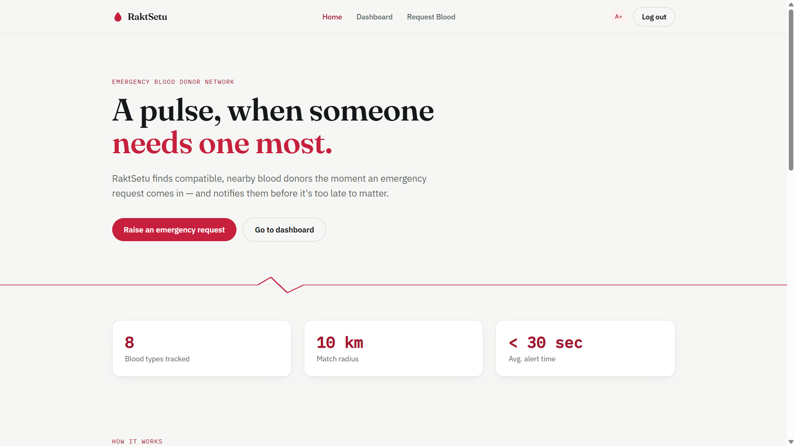
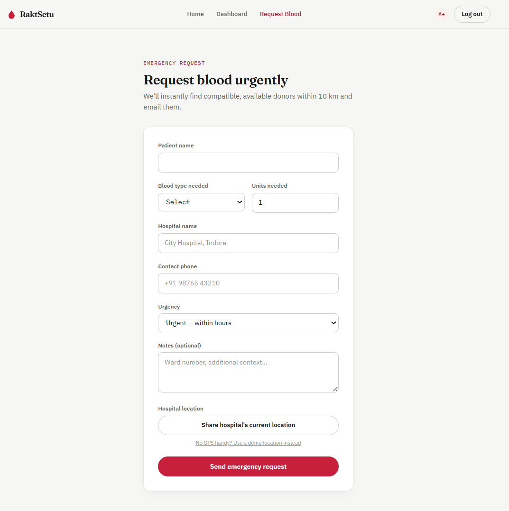
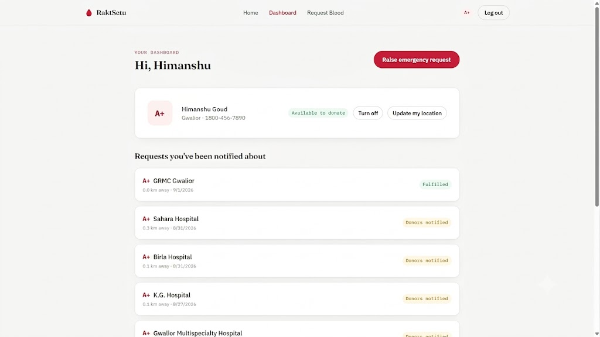

# RaktSetu — रक्त सेतु

**An emergency blood donor network that finds compatible, nearby donors the moment a request comes in — and gets the requester calling them within seconds, not waiting on email.**

🔴 **Live demo:** [raktsetu-phi.vercel.app](https://raktsetu-phi.vercel.app) — try it instantly with the **"Use a demo location instead"** link on the request form, no GPS or account setup required.

[](#testing)
[](#tech-stack)
[](#tech-stack)

---

## Screenshots

<!-- Add 2-3 screenshots here, e.g.: -->
<!--  -->
<!--  -->
<!--  -->

## Why this exists

Blood requests are time-critical, but most donor networks rely entirely on email — which is slow, easy to miss, and useless in an actual emergency. RaktSetu's core design decision is that **the requester should never be stuck waiting**: the moment a request is raised, they see a ranked, callable list of matched donors on-screen, while emails go out in parallel as a backup channel.

## Engineering highlights

A few decisions that go beyond a typical CRUD donor app:

- **Real medical constraint modeled in the matching logic** — donors who donated within the last 90 days are automatically excluded from matching (the standard whole-blood donation gap), with a clear "Resting until [date]" status shown on their own dashboard.
- **Auto-widening search radius** — if no donors are found at 10km, the backend automatically retries at 25km → 50km → 100km before giving up, so a request in a low-donor-density area doesn't just dead-end.
- **Full ABO/Rh compatibility matrix**, not a simplified lookup — covers all 8 blood types and their correct multi-directional compatibility rules.
- **17 passing automated tests** (Vitest) covering the compatibility matrix and the geo-distance/radius-escalation logic, with that logic refactored into a pure, dependency-free module (`backend/utils/geo.js`) specifically so it's unit-testable.
- **Designed around a real free-tier constraint, not around it**: Render's free backend cold-starts after inactivity, so the frontend shows a "waking up the server" banner instead of looking broken during the ~30-60s first request.
- **Live status without polling the user's patience** — a requester's own request page checks for updates every ~10 seconds and surfaces a banner the instant a donor accepts, no manual refresh needed.

## Features

**Requester side**
- Raise an emergency request with blood type, hospital, urgency, and location
- Immediately see a ranked, callable list of matched donors — sorted nearest-first, with each donor's past donation count shown as a trust signal
- Live status updates as donors respond, without refreshing
- A demo-location option so anyone can try the full flow without granting real GPS access

**Donor side**
- Register with blood type + location; update location anytime from the dashboard
- Accept/decline emergency alerts by email or from the dashboard
- See your own 90-day donation cooldown status clearly explained

**Platform**
- Geo-matching via MongoDB `2dsphere` indexes, with automatic radius escalation
- Full ABO/Rh compatibility matrix (all 8 blood types)
- JWT-based auth for donor accounts
- Rate limiting (`express-rate-limit`) on auth and on raising new requests, as basic anti-spam protection
- Rich social share previews (Open Graph/Twitter cards with a custom preview image) so sharing the link on WhatsApp/LinkedIn looks intentional, not broken
- SPA routing that survives a hard refresh on Vercel

## Tech Stack

- **Frontend:** React, Vite, Tailwind CSS
- **Backend:** Node.js, Express, MongoDB (Mongoose) with 2dsphere geospatial indexing
- **Email:** Resend API
- **Testing:** Vitest (17 tests, backend logic)
- **Hosting:** Vercel (frontend), Render (backend), MongoDB Atlas (database)

## Project Structure

```
raktsetu/
├── backend/
│   ├── models/       # Donor, BloodRequest (2dsphere geo index)
│   ├── routes/       # auth, donors, requests (geo-matching + radius escalation)
│   ├── middleware/   # JWT auth guard
│   ├── utils/        # compatibility.js (ABO/Rh matrix), geo.js (distance + radius logic), mailer.js (Resend)
│   ├── scripts/      # seedDemoDonors.js — seeds demo accounts for live testing
│   └── server.js
└── frontend/
    ├── src/pages/       # Home, Register, Login, Dashboard, CreateRequest, RequestDetail
    ├── src/components/  # Navbar, Footer, CompatibilityGrid, PulseLine
    └── src/context/     # AuthContext (JWT session)
```

## Testing

```
cd raktsetu/backend
npm test
```

17 tests covering the blood-type compatibility matrix (all 8 types, both directions) and the geo-distance/radius-escalation logic, run both locally and against the deployed build.

## Running Locally

1. Clone this repository

```
git clone https://github.com/himanshugoud/raktsetu.git
```

2. Set up the backend

```
cd raktsetu/backend
npm install
cp .env.example .env   # fill in MONGO_URI, JWT_SECRET, RESEND_API_KEY
npm run dev
```

3. Set up the frontend

```
cd raktsetu/frontend
npm install
cp .env.example .env   # set VITE_API_URL to <backend-url>/api
npm run dev
```

Visit `http://localhost:5173`.

> **Demo email limitation:** on Resend's free tier, without a verified domain, donor alert emails only deliver to the address you signed up with — not to arbitrary donor emails. This is why the requester-facing call list exists as the primary channel rather than a fallback; email is a bonus, not a dependency. Verify a domain at [resend.com/domains](https://resend.com/domains) to send to real donors.

## Author

Himanshu Goud
